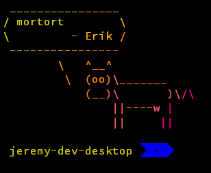

<p align="center">
  <a href="https://dotfiles.github.io/" target="_blank">
    
  </a>
</p>

<p align="center">
    <a href="http://forthebadge.com/" target="_blank">
      
    </a>
    <a href="http://forthebadge.com/" target="_blank">
      
    </a>
</p>

---

# Dotfiles :fish:

## Emoji Index
I've recently started using Emojis in a lot of my commit messages, READMEs, and
wherever I can on GitHub. Here's what each emoji I use represents. It may be
subject to change:

- :tada: - Commits that include something so amazing that I have to celebrate :tada:
- :wrench: - Commits that are relatively small to medium in size
- :warning: - Commits that introduce configs or code that break things

## Introduction
Aside from being free and having a [penguin](https://en.wikipedia.org/wiki/Tux)
for a mascot, a Linux based OS is probably *the* best for customization.
[Dotfiles](https://en.wikipedia.org/wiki/Dotfiles) are essentially hidden files
and directories, such as `~/.bashrc`, `~/.config/`, and `~/.local/` to name a
few.

Dotfiles are not strictly limited to configuration files. You can have
executable scripts, package listings for backups, build files, etc.  (At least,
that's what I have in my dotfiles :stuck_out_tongue_winking_eye:)

As a side note, since this is my personal configuration repo, it is subject to
change rapidly since I tend to change my mind frequently on how I want my setup
to be.

## Features :package:
Although my dotfiles are tailored to my development environment, you can easily
use them as a bootstrap for a new system, a base for your own set of dotfiles,
or even take a subset of my dotfiles and incorporate it into your own.

- Fish
  - [Fisherman](http://fisherman.sh/) for plugins and themes
  - [Keychain](https://wiki.archlinux.org/index.php?title=SSH_keys#Keychain) support for environments where $DISPLAY isn't defined
  - Configuration split into aliases, functions, variables, and completions
- NeoVim
  - Asynchronous autocompletion for a variety of languages using [Deoplete](https://github.com/Shougo/deoplete.nvim)
  - Plugin management using [vim-plug](https://github.com/junegunn/vim-plug)
  - Configuration files split into settings modules
- LaTeX
  - Makefile for compiling LaTeX documents that make use of `pythontex`
  - Template files: `basic.tex` and `math-template.tex`
- A bunch of useful scripts
  - `copy` - Convenience scrpt for the command `rsync -aP`
  - `rmshit` - Sources a list of files to delete file named `~/.shittyfiles`
  - `update` - A big ass script that runs updates
- Arch Linux PKGBUILDs
  - python-click-completion
  - python-click-didyoumean
  - python-pawk
  - refind-theme-regular-git
- Pacman
  - Yaourt for package management and Powerpill for parallel and segmented downloads
- Git
  - Some useful (or useless) git aliases
  - Various custom git commands
  - [hub](https://hub.github.com/) wrapper for CLI interaction with GitHub
- Backup Package Listings
  - Atom Packages
  - npm global modules
  - Fisherman plugins
  - Arch packages separated in to several files
    - `common` - Packages used on all machines
    - `client` - Packages used on a machine that will define `$DISPLAY`
    - `desktop` - Packages used on my desktop machine
    - `macbook` - Packages used on my MacBook Pro
    - `vm` - Packages used on Arch in a virtual machine
- My i3 config file if you want to use that for some reason
- And a bunch more that I can't remember!

## Structure :penguin:
I've structured the repo to map *somewhat* directly to how it would be laid out in your home directory
(with the exception of some of the directories like `packages/`). The directory structure below only
shows files that are symlinked to their respective locations. More detailed instructions on
setting up everything are below.

Note: A `x -> y` will indicate that a symbolic link `y` points to `x`.

```
bin/ # The directory organization is for development purposes. It's best you flatten out your symbolic links
  cleanup           -> ~/.local/bin/cleanup
  copy              -> ~/.local/bin/copy
  docker-clean      -> ~/.local/bin/docker-clean
  ...
config/
  fish/
    aliases.fish      -> ~/.config/fish/aliases.fish
    completions.fish  -> ~/.config/fish/completions.fish
    ...
  gitconfig           -> ~/.gitconfig
  i3/
    compton           -> ~/.config/i3/compton
    config            -> ~/.config/i3/config
  npmrc               -> ~/.npmrc
  nvim/
    init.vim          -> ~/.config/nvim/init.vim
    mthesaur.txt      -> ~/.config/nvim/thesauraus.txt
    spell             -> ~/.config/nvim/spell
    UltiSnips         -> ~/.config/nvim/UltiSnips/
    vintrc.yaml       -> ~/.vintrc.yaml
  pacman/ # The following symlinks require root permission
    makepkg.conf      -> /etc/pacman.d/makepkg.conf
    pacman-aria2.conf ->/etc/pacman.d/pacman-aria2.conf
    pacman.conf       -> /etc/pacman.conf
    powerpill.json    -> /etc/powerpill/powerpill.json
    yaourtrc          -> /etc/yaourtrc
  ssh-config          -> ~/.ssh/config # Note: You most likely won't be using this *as is*
  terminator-config   -> ~/.config/terminator/config
misc/
  shittyfiles         -> ~/.shittyfiles
```

## Installation :wrench:
Until I create a setup script to automate installation, you'll have to do it
manually :^( All examples below will be using fish shell syntax. You should be
able to convert the shell code below into bash or zsh.

Of course, you'll need to clone the dotfiles somewhere. For the sake of
simplicity, we'll clone it to `$HOME`:
```fish
$ git clone git://github.com/codemonkey800/dotfiles.git ~/dotfiles
$ cd ~/dotfiles
```

### `bin/` Scripts
First, create directory at `~/bin/` and then copy every file in
`~/dotfiles/bin/` to that directory:
```fish
$ mkdir -p ~/bin
$ ln -svf $PWD/* ~/bin
```

### Backup Package Listings
You can install from the package listings `cat`ing the listings you want to use
in a command substitution (or subshell), and use it as an argument for
`yaourt -S`.
```fish
$ yaourt -S (cat packages/arch/{common,client,desktop})
# If you're lazy, you can also do this:
$ yaourt -S --noconfirm (cat packages/arch/{common,client,desktop})
```

### Fortunes - Fancy Greeting Message on Login
For my shell, I have fancy login greetings made using
[lolcat](https://github.com/tehmaze/lolcat/),
[cowsay](https://github.com/piuccio/cowsay), and
[Fortune](https://wiki.archlinux.org/index.php/Fortune). Make sure you install
all three, then you can run:
```fish
$ sudo cp misc/myfortunes /usr/share/fortunes # /usr/share/games/fortune-mod on ubuntu
$ sudo strfile /usr/share/fortunes/myfortunes
```



### Fisherman
Once you've symlinked all the fishfiles and installed fisherman, you can run:
```fish
cat packages/fishfile | fisherman
```

### nvim
First, you have to install vim-plug:
```fish
$ curl -fLO ~/.config/nvim/autoload/plug.vim --create-dirs \
  https://raw.githubusercontent.com/junegunn/vim-plug/master/plug.vim
```

Once you've symlinked everything correctly, you can run `update-plug` do a
quick and easy installation.

### Pacman
Warning: You need to have installed Powerpill before symlinking
`config/pacman/yaourtrc -> /etc/yaourtrc`.  Failing to do so will cause an
error since, from `yaourt`'s perspective, the `powerpill` command doesn't
exist.

Also, some packages in `arch/` are submitted on the [Arch User
Repository](https://aur.archlinux.org/).  But not all of them are. If you want
to build those that aren't, or if you just want to build anything, you can go
into each directory and run:
```fish
$ makepkg -si
```

to build and install the package.

### Atom
Once you've installed Atom and APM, you can run:
```fish
$ apm install (cat packages/apm)
```

### npm
I local Node.js/npm distrubtions using `fnm`. However, I still do use global
modules with those distributions. You can run:
```fish
$ npm -g i (cat packages/npm)
```

## macOS/Windows Support :computer:
Some of my dotfiles will be incompatible with macOS and Windows. For example,
anything pacman related cannot be used.  Any other settings that are highly
dependent on either a Linux based OS or Arch Linux won't work on macOS or
Windows.

For Windows, you'll most likely either need to install
[Cygwin](https://www.cygwin.com/), use the [Bash
Subsystem](https://msdn.microsoft.com/en-us/commandline/wsl/about), or run a
Linux distro in a VM.

Personally, I use Windows on my desktop and run Arch in VMWare Workstation.

## License :page_with_curl:
The MIT License (MIT)

Copyright (c) 2016 Jeremy Asuncion

Permission is hereby granted, free of charge, to any person obtaining a copy
of this software and associated documentation files (the "Software"), to deal
in the Software without restriction, including without limitation the rights
to use, copy, modify, merge, publish, distribute, sublicense, and/or sell
copies of the Software, and to permit persons to whom the Software is
furnished to do so, subject to the following conditions:

The above copyright notice and this permission notice shall be included in all
copies or substantial portions of the Software.

THE SOFTWARE IS PROVIDED "AS IS", WITHOUT WARRANTY OF ANY KIND, EXPRESS OR
IMPLIED, INCLUDING BUT NOT LIMITED TO THE WARRANTIES OF MERCHANTABILITY,
FITNESS FOR A PARTICULAR PURPOSE AND NONINFRINGEMENT. IN NO EVENT SHALL THE
AUTHORS OR COPYRIGHT HOLDERS BE LIABLE FOR ANY CLAIM, DAMAGES OR OTHER
LIABILITY, WHETHER IN AN ACTION OF CONTRACT, TORT OR OTHERWISE, ARISING FROM,
OUT OF OR IN CONNECTION WITH THE SOFTWARE OR THE USE OR OTHER DEALINGS IN THE
SOFTWARE.
