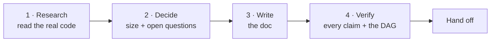
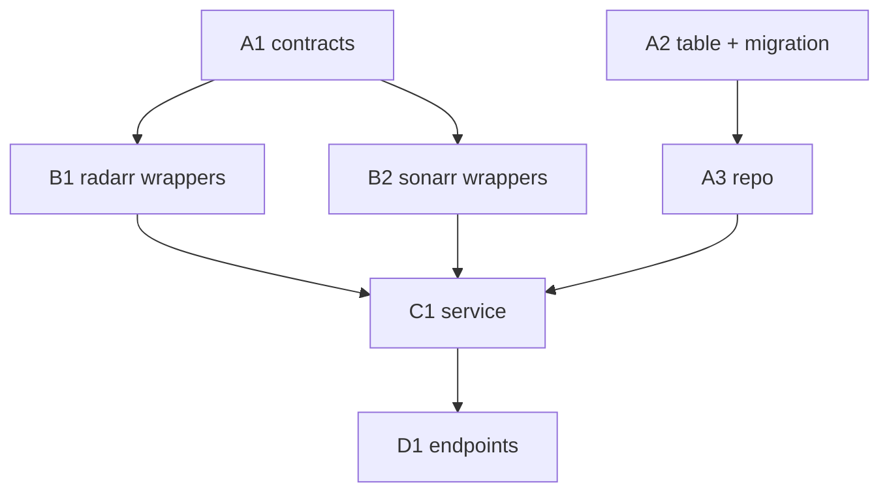

# plan-doc

Write **one markdown file** that another session can execute without asking a single
clarifying question.

The reader is not you and has none of your context. Everything they need is either in
the doc or verifiable from the code the doc points at.

## Input

<description> #$ARGUMENTS </description>

Empty `<description>`? Take the subject from the conversation. If there isn't one, ask
what to plan — **one** question, then get to work.

---

## The shape of the work



Research is not optional and it is not skimming. A plan that names a file that doesn't
exist, or a function whose signature moved, sends a sub-agent down a hole it can't see
the top of. **Every path, symbol, and command in the doc must have been checked.**

---

## 1 · Research

Read before you write:

- **The code the plan touches** — actual files, not a mental model of them. Cite
  `path/to/file.ts:42` so the reader can jump there.
- **The conventions** — where tests live, how they're run, lint and type-check
  commands, migration numbering, DI/module registration, barrel exports, commit style.
  Copy the conventions; don't invent better ones inside a plan doc.
- **What already exists vs. what doesn't.** Half of a good plan is "don't rebuild
  this, it's already there at `x.ts:88`."
- **Adjacent consumers** — anything that breaks when this changes, and whether it's in
  scope or held compiling by a shim.

Fan out with parallel `Explore` sub-agents when the surface is wide. Ask the user only
about decisions the code genuinely cannot answer.

> **Phase 0 pattern.** When a plan rests on an assumption you can cheaply test — a
> library behaves a certain way, an upstream field is populated, a generated client
> exposes the endpoint — make verifying it **Phase 0**, and write the plan's downstream
> shape only after the answer lands. A wrong assumption discovered in Phase 5 costs
> every phase between.

---

## 2 · Decide the size

| Scope | Shape |
|---|---|
| 1–3 obvious changes | **No doc.** Just do the work. A plan doc here is ceremony. |
| ~4–15 tasks, one sitting or one PR | One doc, tasks in **groups A–F**, one wave table |
| 15+ tasks, multiple PRs, or multi-week | One doc split into **phases 0–N**, each phase with its own groups and waves |
| Several large, separately shippable chunks | A doc **per phase**, numbered `001-`, `002-`, … cross-linking each other |

**Phase boundaries** go where the work naturally checkpoints: a migration lands, an API
contract changes, an integration point needs to be exercised, or the change becomes
independently shippable. Number from **Phase 0 — Prep** when there are assumptions to
verify first.

### Where the file goes

Follow the repo's existing convention. If `docs/**/plans/` exists, use it with the next
free number — `docs/features/<area>/plans/004-<slug>.md`. Otherwise fall back to
`docs/plans/NNN-<slug>.md`. Say the path in your closing message.

---

## 3 · Write the doc

Sections, in this order. Skip a section only when it is genuinely empty; say so rather
than silently dropping it.

| # | Section | Carries |
|---|---|---|
| 1 | **Overview** | The human's map of the plan — what's changing, why, its shape, and the key decisions in brief, with links down into every section below |
| 2 | **How to work this plan** | The execution protocol — checkboxes, `/commit`, status markers |
| 3 | **Instructions for the orchestrator** | Delegation rules, if this plan is orchestrated |
| 4 | **Design decisions** | What was chosen, why, and what was ruled out |
| 5 | **Shared Context Pack** | Everything a sub-agent needs pasted into its prompt |
| 6 | **Task List** | Grouped checkboxes — the body of the plan |
| 7 | **Sequencing** | DAG, waves, dependency table, critical path, human checkpoints |
| 8 | **Final report** | What the executor reports when the last box is checked |

The doc is a mix of two audiences: a human deciding whether this is the right plan, and
an executor that needs every file path and edge case spelled out. The Overview is where
the human's read ends and the executor's detail begins — concise and plain language, but
not thin. A reader who stops there should still know what's changing, why, how it's
structured, and what was decided. Anything that needs more gets a link down to where the
detail actually lives — `[Design decisions](#design-decisions)` for the why,
`[Task List](#task-list)` for the what, `[Sequencing](#sequencing)` for the order and the
human checkpoints — so the reader chooses their own depth instead of scrolling past detail
built for a sub-agent.

`reference/template.md` is the fill-in skeleton, with sections 2, 3, 5's Definition of
Done, and 8 written out verbatim — copy them, adapt the placeholders.

Write the prose per the `bruh` skill's compose mode: bullets over walls, mermaid for
anything with shape, bold the key term not the sentence.

---

## Task list

The part that gets read most and skimmed least. Rules:

- **One checkbox per task.** `- [ ] **A3. Bad-files repo.**` — an ID, a bold title, then
  the body.
- **IDs are `<GroupLetter><n>`.** Groups cluster tasks that share a concern
  (contracts, persistence, HTTP layer, verification). In a phased doc, IDs restart per
  phase and are referenced as `Phase 3 · A1`.
- **Name the files.** "create `src/db/bad-files.repo.ts`, edit `src/db/schema.ts`" —
  the sub-agent should not have to guess where the code goes.
- **Show the interface** in a fenced block when the shape matters more than the prose:

  ```ts
  insertBadFile(db, row): Promise<void>   // idempotent on the unique index
  listBadFilesByMediaId(db, mediaId): Promise<BadFileRow[]>
  ```

- **Call out edge cases explicitly.** "An absent id is a no-op success, not an error."
  These are what separate a task that lands from one that comes back for a second pass.
- **Say what the tests must cover** — not the assertions, the behaviors.
- **Size each task to one sub-agent and one commit.** If it needs two unrelated commit
  messages, it's two tasks. If it can't be described without a page of context, split it.
- **Every task is independently verifiable.** A task that can only be checked by running
  the next one is not a task, it's half of one.
- **Tag what must not be built.** Blocked or out-of-scope rows carry a marker (🚧 needs
  a surface that doesn't exist, ⏳ blocked on a later phase) and an explicit "never
  implement a tagged row" instruction. Also mark files that must not be modified.

### Definition of Done

One block, quoted verbatim into every delegation, ending in a commit:

> **Done means:** implemented; tests written or updated following the package's
> existing conventions and passing; lint and type-check clean for every touched
> package; committed with `/commit`. Report back: files changed, exported names
> introduced, test summary, commit hash(es).

Add an **addendum** when a task's verification differs — a harness whose suites are
manual-only, say, gets "❌ do not run `pnpm run test:live`; verify with `--listTests`
instead."

---

## Sequencing

### Build the DAG from real dependencies

B depends on A only when B needs something A *creates* — an exported name, a file, a
migration number, a column. "B is conceptually later than A" is not a dependency; it's
an opinion, and it costs you parallelism.



### Then check what actually collides

Two tasks with no DAG edge still can't run together if they:

| Collision | Example |
|---|---|
| **Same file** | Two tasks both extending `release.service.ts` and its spec |
| **Shared manifest** | `package.json`, the lockfile, a barrel `index.ts`, a DI module |
| **Sequential numbering** | Two migrations both claiming `0005` |
| **Same branch, concurrent `/commit`** | Staging interleaves and commits capture each other's work |

> The last one is the one that bites. **Concurrent sub-agents running `/commit` on one
> branch will cross-contaminate.** Either give each an isolated worktree, or serialize
> the commit step. Say which, in the plan.

### Publish three views

1. **Waves table** — `Wave | Run | Why it works`. One row per wave; the "why" names the
   isolation that makes it safe.
2. **Dependency table** — `Task | Depends on | Parallel with`. Redundant with the DAG on
   purpose: it's the one an executor actually reads mid-run.
3. **Critical path** — the single chain that sets the floor on wall-clock, called out by
   name, plus which task leads and why.

### Integration checkpoints and human checkpoints

- **Integration checkpoint** — a task whose entire job is to prove the pieces fit
  (wiring, full-suite green, full-repo build). Every plan needs at least one, near the
  end, and it must see every prior commit.
- **Human checkpoint** — anything the executor must **not** do: run something against
  production, deploy, rotate a credential, spend real money, delete real data, or make a
  judgment call the plan can't make for it. List these explicitly under their own
  heading, in order, with what each one is checking for.

---

## Orchestration

If the plan will be executed by an orchestrator delegating to sub-agents, the doc says
so up front, in its own section. The rules that make it work:

**The orchestrator delegates and nothing else.**

- Every task goes to a sub-agent — implementation, tests, and the commit included.
- ❌ It does not read or edit source, tests, or config. The **only** file it may edit is
  the plan, to check boxes and record outcomes.
- ❌ It does not fix a failing task itself. It re-delegates with the failure details.

**Delegation prompts are self-contained.**

- ❌ Sub-agents never read the plan doc. Reading a plan means reading tasks that aren't
  theirs and boundaries they'll misapply.
- Each prompt carries: the task's full text, the relevant Context Pack sections, the
  Definition of Done, and — when the task depends on an earlier one — the **actual names
  the earlier sub-agent reported** (exports, file paths, schema names) pasted in.
- Each sub-agent reports back files changed, exported names, test results, commit hashes.

**The Context Pack exists to make that possible.** It's the pointers a sub-agent would
otherwise have to rediscover: conventions, the file-layout table, patterns to imitate
(with the canonical example file named), gotchas, env keys, the Definition of Done.
Label it as pointers to **verify against current code**, not as gospel — a plan ages,
the code is the truth.

---

## How to work this plan

The doc must tell its executor how to interact with it. This section goes **in the
generated doc**, near the top — it's the first thing someone opening it six weeks from
now needs.

**Per task:**

1. Work tasks in wave order. Never start one before its dependencies report green.
2. Implement → write or update tests → run the package's tests, lint, and type-check.
3. **`/commit`** — one task, one commit (or a small coherent set). `/commit` stages at
   line level, so an unrelated stray edit in the same file doesn't ride along. In an
   isolated worktree, pass `in:<abs path>`.
4. Check the box and append the commit hash.

**Markers:**

| Marker | Means |
|---|---|
| `- [ ]` | Not started |
| `- [x]` … `abc1234` | Done, with the commit that did it |
| ⚠️ **PARTIAL** | Landed with scope narrowed — say what was left and why, right there |
| ⏭️ **DROPPED** | Not doing it — say why. **Never delete a task**; a deleted task looks like it was never planned |
| 🚧 / ⏳ | Blocked. Do not implement |

**When reality disagrees with the plan** — and it will — record it inline under the
task as a short **Findings** note, then update the downstream tasks the finding
invalidates. A plan that silently drifts from what shipped is worse than no plan,
because the next reader trusts it.

---

## Final report

Close the doc with what the executor reports when the last box is checked:

1. Per-task outcome, with commit hashes
2. Test results — per package and repo-wide
3. Deviations from the plan, and why
4. Deferred items, including every human checkpoint still outstanding
5. Open questions discovered during implementation

---

## Anti-patterns

- **The unresearched plan** — file paths that don't exist, signatures that moved. Every
  sub-agent it touches burns its context rediscovering the truth.
- **Fake parallelism** — a wave table whose tasks all edit the same file.
- **The task that needs the plan** — if a sub-agent can't act on the prompt alone, the
  task is underspecified, not the sub-agent.
- **The orchestrator who codes** — starts with "I'll just fix this one lint error,"
  ends holding a context full of implementation detail and no idea what's delegated.
- **Unverifiable tasks** — "improve error handling." Against what assertion?
- **Ceremony** — phases, waves, and a context pack for four hours of work.
- **The stale plan** — checked boxes describing code that shipped differently.

---

## Calibration

The doc should be as long as the work is complicated and no longer. A four-task plan
gets one page: framing, tasks, a wave line, done. A thirty-task migration earns the full
structure — because at that size, the sequencing *is* the plan.

Related: `bruh` for how the prose should read · `commit` for the commit step every task
ends in.
